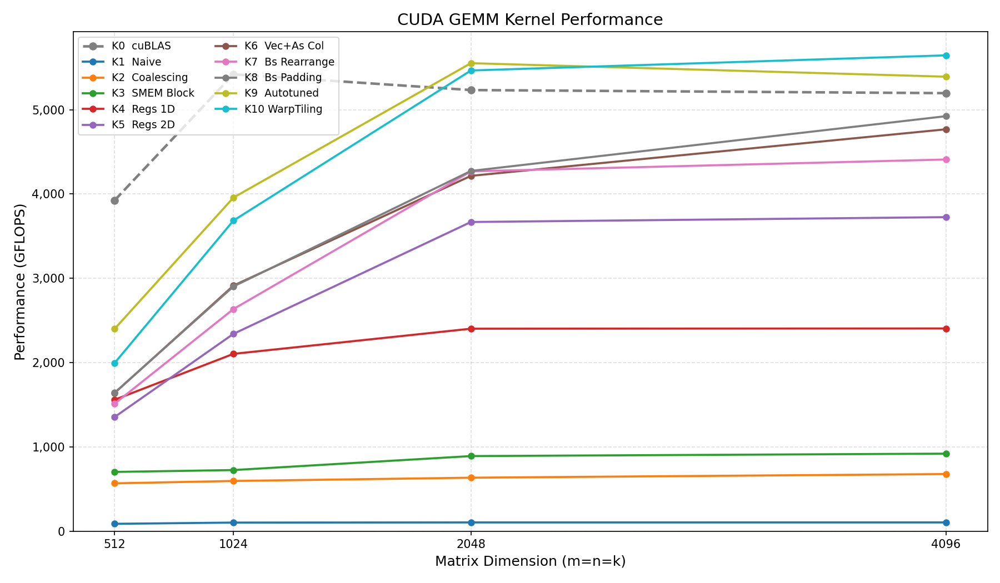

# CUDA GEMM Kernel Optimization

本项目从零实现一系列 CUDA GEMM（General Matrix Multiply）内核，逐步引入优化技术，最终接近 cuBLAS 的性能水平。所有内核计算标准 GEMM 公式：

```
C = α × (A @ B) + β × C
```

---

## 性能折线图



> 使用 `uv run plot_performance.py` 生成，可传入指定维度，例如 `uv run plot_performance.py 512 1024 2048 4096`。

---

## 性能汇总（矩阵维度 4096）

| 内核 | 描述 | GFLOPS | vs cuBLAS |
|------|------|--------|-----------|
| Kernel 0 | cuBLAS（参考基准） | 5197.3 | 100.0% |
| Kernel 1 | Naive | 103.5 | 2.0% |
| Kernel 2 | Global Memory Coalescing | 677.1 | 13.0% |
| Kernel 3 | Shared Memory Blocking | 919.5 | 17.7% |
| Kernel 4 | Regs 1D Blocktiling | 2405.2 | 46.3% |
| Kernel 5 | Regs 2D Blocktiling | 3761.0 | 72.4% |
| Kernel 6 | 向量化 + As 列主序（消除 As Bank Conflict） | 4781.4 | 92.0% |
| Kernel 7 | Bs 重排（尝试消除 Bs Bank Conflict，负优化） | 4429.7 | 85.2% |
| Kernel 8 | Bs SMEM Padding（正确消除 Bs Bank Conflict） | 4976.8 | 95.8% |
| Kernel 9 | Autotuned 2D Warp Tiling（BK=16, BM=BN=128, TM=TN=8） | 5392.6 | 103.8% |
| Kernel 10 v1 | Warp Tiling（BM=BN=128, BK=16, WM=WN=64, WNITER=4, TM=8, TN=4, NT=128） | **5840.8** | **112.4%** |

---

## 各内核详细说明

### Kernel 1：Naive（朴素实现）

**性能：103.5 GFLOPS（2.0% of cuBLAS）**

最简单的实现：每个线程计算 C 的一个元素，直接循环 K 次读取 A 的一行和 B 的一列并累加。

**问题：全局内存访问模式极差**

以 warp 0（线程 x=0..31, y=0）为例，第 i 次迭代时：

- **A 的访问**：`A[x*K + i]`，相邻线程地址间距 = K×4 字节（远超 cache line），退化为 32 次独立内存事务（最差情况）
- **B 的访问**：`B[i*N + y]`，warp 内所有线程 y 相同，访问同一地址，GPU 广播机制，1 次事务（偶然最优）
- **C 的写回**：`C[x*N + y]`，相邻线程地址间距 = N×4 字节，退化为 32 次独立事务

> 性能瓶颈：A 和 C 的散乱访问使带宽利用率极低，每条 cache line（128 字节）只用到 4 字节（3.1%）。

---

### Kernel 2：Global Memory Coalescing（全局内存合并访问）

**性能：677.1 GFLOPS（+554% vs Kernel 1）**

**优化核心：调整线程到元素的映射关系**，把 warp 内线程的变化维度从"行"换成"列"：

```
// Naive：   x → 行，y → 列（warp 内 x 变化 → 行地址跳变）
// Kernel 2：cRow → 行，cCol → 列（warp 内 cCol 连续 → 列地址连续）
const int cRow = blockIdx.x * BLOCKSIZE + (threadIdx.x / BLOCKSIZE);
const int cCol = blockIdx.y * BLOCKSIZE + (threadIdx.x % BLOCKSIZE);
```

交换映射后，同一 warp 内 32 个线程的 cCol 连续递增：

| 访问目标 | Naive | Kernel 2 |
|---------|-------|---------|
| A[cRow*K + i] | 32 线程行不同，stride=K，32 次事务 | 32 线程行相同，广播，1 次事务 ✓ |
| B[i*N + cCol] | 32 线程列相同，广播，1 次事务 | 32 线程列连续，coalesced，1 次事务 ✓ |
| C[cRow*N + cCol] | stride=N，32 次事务 | 列连续，coalesced，1 次事务 ✓ |

> 原理：warp 内 32 个线程的地址落在同一 128 字节对齐 cache line 时，硬件合并为 1 次事务。32 个 float × 4 字节 = 128 字节，恰好填满 1 条 cache line。

---

### Kernel 3：Shared Memory Blocking（共享内存分块）

**性能：919.5 GFLOPS（+35.8% vs Kernel 2）**

**优化核心：引入共享内存（SMEM）tile 缓存，让数据在 SMEM 内被复用**

算法框架：
1. 外层循环沿 K 方向按 `BLOCKSIZE` 步长分 tile 迭代
2. 每次迭代：block 内所有线程协作将 A/B 的一个 tile 加载到 SMEM（每线程加载 1 个元素）
3. `__syncthreads()` 确保全部加载完成后
4. 每个线程从 SMEM 读取数据完成该 tile 的点积累加

**关键收益：全局内存读次数大幅减少**

- Kernel 2：每个线程独立从 GMEM 读 K 次 A、K 次 B（无复用）
- Kernel 3：block 内 BLOCKSIZE² 个线程协作，每份 tile 数据只从 GMEM 读 1 次，在 SMEM 内被复用 BLOCKSIZE=32 次

SMEM 用量：As + Bs = 2 × 32×32×4 = 8 KiB。第二个 `__syncthreads()` 防止快线程提前进入下一 tile 覆盖慢线程还在读的数据。

---

### Kernel 4：Regs 1D Blocktiling（寄存器缓存 + 一维分块 Tiling）

**性能：2405.2 GFLOPS（+161.4% vs Kernel 3）**

**优化核心：每线程计算 TM=8 个 C 元素（M 方向），引入 `tmpB` 寄存器缓存减少 SMEM 读取**

```
// Kernel 3：每 dotIdx 迭代都从 SMEM 读一次 Bs
for dotIdx in BK:
    tmp += As[row][dotIdx] * Bs[dotIdx][col]

// Kernel 4：Bs 值读一次存入寄存器，复用 TM 次
for dotIdx in BK:
    tmpB = Bs[dotIdx][threadCol]  // 读 1 次，缓存到寄存器
    for resIdx in TM:
        threadResults[resIdx] += As[threadRow*TM+resIdx][dotIdx] * tmpB
```

**收益**：每个 dotIdx 节省 TM-1=7 次 SMEM 读；BK=8 次迭代共节省 56 次/tile。

参数：BM=64, BN=64, BK=8, TM=8，blockDim=BM×BN/TM=512 线程/block。`threadResults[TM]` 数组全驻寄存器，无 SMEM 中间写回。

---

### Kernel 5：Regs 2D Blocktiling（寄存器缓存 + 二维分块 Tiling）

**性能：3761.0 GFLOPS（+56.4% vs Kernel 4）**

**优化核心：每线程计算 TM×TN=8×8=64 个 C 元素（M 和 N 双向展开），同时缓存 As 和 Bs 到寄存器**

```
for dotIdx in BK:
    for i in TM: regM[i] = As[(threadRow*TM+i)*BK + dotIdx]  // 缓存 TM 个 As 值
    for i in TN: regN[i] = Bs[dotIdx*BN + threadCol*TN + i]  // 缓存 TN 个 Bs 值
    for resIdxM in TM:
        for resIdxN in TN:
            threadResults[resIdxM*TN+resIdxN] += regM[resIdxM] * regN[resIdxN]
```

**关键技术：`__launch_bounds__`**

blockDim=256 时，每线程需要约 121 个寄存器（threadResults[64] + regM[8] + regN[8] + 标量变量）。不声明 `__launch_bounds__` 时，编译器按最坏情况 1024 线程/block 估算，每线程只允许 64 个寄存器 → regM/regN 溢出到 local memory（约 300 cycle/access）。添加 `__launch_bounds__((BM*BN)/(TM*TN), 1)` 后编译器知道实际 256 线程，放开到 256 个寄存器/线程，所有数组驻寄存器，0 spill。

**此阶段存在的 Bank Conflict（BM=BN=128）**

计算阶段读 SMEM 存在 bank conflict：
- As 读（2-way conflict）：warp 内仅 2 个不同 threadRowGroup，步长 TM=8，周期 32/8=4，2 路冲突
- Bs 读（4-way conflict）：BN/TN=16 个唯一 threadColGroup，步长 TN=8，周期 32/8=4，16/4=4 路冲突

---

### Kernel 6：向量化 + As 列主序（消除 As Bank Conflict）

**性能：4781.4 GFLOPS（+27.1% vs Kernel 5）**

**优化1：float4 向量化内存访问**

将全局内存的标量 load/store 替换为 `ld.global.v4.f32`（float4），一条指令读取 4 个连续 float（128-bit）：

- 全局内存 load 指令数 ÷ 4
- 要求 16 字节对齐：`cudaMalloc` 保证基址 256 字节对齐；偏移量必须是 16 的整数倍

**优化2：As 转置为列主序存储，消除 As 读 Bank Conflict**

As 改为列主序（转置）写入 SMEM：

```cpp
// 行主序（Kernel 5，有 bank conflict 但 STS.128 phase 消除）：
As[innerRowA * BK + innerColA] = tmp;  // 地址连续 → STS.128 → 0 conflict

// 列主序（Kernel 6，改善计算阶段读 bank conflict）：
As[(innerColA*4+0)*BM + innerRowA] = tmp.x;  // 地址步长 BM → STS.32 × 4 → 2-way write conflict
```

**STS.128 Phase 机制（行主序写 As 为何实际 0 conflict）**：

float4 写入连续地址 → 编译器生成 STS.128 → 硬件分 4 个 phase 执行：
- Phase 0：thread  0-7  → As[0..31]   → bank 0-31 各 1 次 → 0 conflict
- Phase 1：thread  8-15 → As[32..63]  → bank 0-31 各 1 次 → 0 conflict
- Phase 2：thread 16-23 → As[64..95]  → bank 0-31 各 1 次 → 0 conflict
- Phase 3：thread 24-31 → As[96..127] → bank 0-31 各 1 次 → 0 conflict

列主序写 As 时，4 个目标地址步长 = BM（非连续）→ 编译器无法生成 STS.128 → 退化为 4 条 STS.32 → 2-way write conflict。

**FMA 掩盖（FMA Masking）机制**：

As 写入 conflict 发生在加载阶段。但与此同时 kernel 5 中 As 和 Bs 两个 conflict 共存，组合 stall 总量超出 FMA 掩盖阈值，有真实代价；切换到列主序后 As 读 conflict 消除，net 正收益。

| 阶段 | kernel 5 行主序 | kernel 6 列主序 |
|------|--------------|--------------|
| As 写（加载阶段） | STS.128 phase → 0 conflict | 4×STS.32 → 2-way conflict |
| As 读（计算阶段） | 2-way conflict | 0 conflict（列主序改变 threadRow 间 bank 分布）|
| 净效果 | — | 正收益（消除读 conflict 收益 > 写 conflict 代价）|

性能对比（4096 维度）：
- 仅向量化：3927.6 GFLOPS
- 向量化 + As 列主序：4698.7 GFLOPS（+19.6%）

---

### Kernel 7：Bs 重排（负优化）

**性能：4429.7 GFLOPS（-7.4% vs Kernel 6）**

**目标**：通过对 Bs 的布局重排（linearize），消除计算阶段读 Bs 的 4-way bank conflict。

**映射规则**：

```
B[r][c] → Bs[new_row * 16 + new_col]
new_row = r * TN + c % TN   （原始行 × TN + 列内偏移）
new_col = c / TN             （列组号）
```

重排后读 Bs：`regN[i] = Bs[(dotIdx*8+i)*16 + threadCol]`，threadCol 步长=1 → 16 个不同 bank → 0 conflict ✓

**为何实测反而更慢？——两阶段代价不对称**

**① Kernel 6 Bs 写入本就是 0 conflict（STS.128 phase 机制）**

Kernel 6 使用 float4 写 Bs（地址连续）→ 编译器生成 STS.128 → phase 执行 → 每 phase 覆盖全部 32 bank 各 1 次 → **0 bank conflict，1 条指令**。

Kernel 7 的优化起点已是 0 conflict，而非预想的 4-way conflict。

**② Kernel 7 写 Bs 从 0 conflict 退化为 2-way conflict + 4× 指令数**

重排后写 Bs 目标地址不连续（步长 = BN/TN = 16）→ 无法生成 STS.128 → 退化为 4 条 STS.32：
- 2-way bank conflict（步长 16，周期 32/16=2）
- 指令数从 1 增加到 4

**③ 计算阶段 Bs 读 conflict 实际代价 ≈ 0（FMA 掩盖）**

计算阶段存在大量 FMA 运算（BK=8 外层 × TM×TN=64 内层 FMA/tile）。某 warp 读 Bs 发生 stall 时，调度器切换其他 warp 执行 FMA，stall 延迟被完全掩盖。Kernel 6 中 Bs 读 conflict 已几乎免费，消除它的收益 ≈ 0。

**④ 加载阶段 conflict 无法被掩盖**

加载阶段结束后立刻遇到 `__syncthreads()`，全 block 等齐后才开始 FMA。加载阶段内无 FMA 可填充 stall → **写入 conflict 代价完全暴露**。

```
kernel_6：[──加载（0 conflict，1 条指令）──]──sync──[────FMA（4-way 读 conflict ≈ 0）────]
kernel_7：[────加载（2-way + ×4 指令）────]──sync──[────FMA（0 读 conflict）────]
                  ↑ 额外加载时间无法被 FMA 掩盖
```

**⑤ FMA 掩盖的容量上限**

同时存在多个 conflict 源时，组合 stall 量可能超出 FMA 掩盖阈值：
- Kernel 5 基准（As+Bs 均有 conflict）：组合 stall 超阈值 → 消除 As conflict 有正收益
- Kernel 6 基准（只剩 Bs conflict）：单一 stall 在阈值内 → Bs 读 conflict ≈ 免费 → 消除无益

| | Bs 写入（加载阶段） | Bs 读（计算阶段） | 实测 |
|--|--|--|--|
| Kernel 6 | STS.128 phase → 0 conflict，1 条指令 | 4-way（FMA 掩盖 ≈ 0） | 4699 GFLOPS |
| Kernel 7 | 4×STS.32，2-way conflict，4 条指令 | 无 conflict（收益 ≈ 0）| 4377 GFLOPS |

**关于 compute-bound 的推断（局部 vs 全局）**

FMA 掩盖 Bs 读 conflict → SMEM 延迟在计算阶段内不是瓶颈，但这只是**局部结论**。FMA masking 的作用范围仅限于相邻两次 `__syncthreads()` 之间的计算阶段；`__syncthreads()` 是 block 级屏障，block 内所有 warp 全部停止，warp 切换失效，FPU 在屏障处真正空转——FMA masking 再好也无法填补这段空转：

```
[──计算阶段（FMA masking 有效）──]──sync（FPU 空转）──[──计算阶段──]──sync──...
         ↑ FMA masking 作用范围       ↑ 独立瓶颈，与 FMA masking 不重叠
```

Kernel 9 增大 BK（8→16）减少 sync 频率仍有性能提升（第二层瓶颈）；4096 时 L2 命中率下降又是第三层独立瓶颈（GMEM 带宽）。三层瓶颈相互独立，共同说明尚未达到全局 compute-bound。

---

### Kernel 8：Bs SMEM Padding（正确消除 Bs Bank Conflict）

**性能：4976.8 GFLOPS（+12.3% vs Kernel 7，+4.1% vs Kernel 6）**

**设计思路**：在保留 float4 向量写入（STS.128，0 write conflict）的前提下，为 Bs 添加 SMEM padding，正确选择 extraCols 使所有行首地址满足 16 字节对齐。

**核心改进：为 Bs SMEM 添加额外列（padding）**

```cpp
constexpr uint extraCols = 4;
__shared__ float Bs[BK * (BN + extraCols)];  // 行步长从 BN=128 变为 BN+4=132
```

**为何 extraCols = 4？（16 字节对齐要求）**

float4 写 Bs 要求每行首地址满足 16 字节对齐，stride = BN + extraCols 个 float：
- extraCols=4：stride=132，每行偏移 132×4=528 字节，528%16=0 ✓ → 所有行 STS.128 保留
- extraCols=5：stride=133，每行偏移 133×4=532 字节，532%16=4 ✗ → 第 1、2、3…行不对齐，退化为 4×STS.32 + 4-way write conflict，性能骤降至 3754.5 GFLOPS

extraCols 必须是 **4 的整数倍**，才能保证所有行的 16 字节对齐。

**Bs 读 Bank Conflict 分析**

Bs 读地址：`Bs[innerColIdx * (BN + extraCols) + colIdx + threadColGroup * TN]`

warp 内 32 线程，threadColGroup j = threadIdx.x % 16，取值 0..15，每值出现两次（同地址 → broadcast）。对固定 innerColIdx 和 colIdx，j 的 bank：

```
Bank(j) = (innerColIdx × 4 + colIdx + j × 8) % 32  （132 ≡ 4 mod 32）
```

step = TN = 8，周期 = 32 / 8 = 4：j=0,4,8,12 访问的地址不同但 bank 相同 → **4-way bank conflict**。

此冲突与 padding **无关**（step=8 由 TN 决定），padding 无法消除它。

**Padding 的真实作用仅限于写入阶段**

| | Kernel 6（stride=128）| Kernel 8（stride=132）|
|--|--|--|
| Bs 写（加载阶段） | STS.128，0 conflict ✓ | STS.128，0 conflict ✓（extraCols=4 保持对齐）|
| Bs 读（计算阶段） | 4-way conflict（FMA 掩盖） | 4-way conflict（FMA 掩盖，未消除）|
| 实测性能 | 4781.4 GFLOPS | 4976.8 GFLOPS |

kernel 8 相对 kernel 6 约 4% 的性能提升，从纯 bank conflict 分析角度难以解释（两者读写 conflict 结构相同）。精确归因需借助 `ncu` 硬件性能计数器，可能涉及编译器指令调度差异或其他微架构效应。

**完整改进总结**

| 指标 | Kernel 6 | Kernel 8 |
|------|---------|---------|
| As 存储布局 | 列主序（转置），0 读 conflict | 列主序（转置），0 读 conflict |
| Bs 写指令 | STS.128（float4），0 write conflict | STS.128（float4，stride=132 对齐），0 write conflict |
| Bs 计算阶段读 | 4-way conflict（FMA 掩盖） | 4-way conflict（FMA 掩盖，padding 不消除） |
| 向量化写回 C | float4 | float4 |
| 实测性能 | 4781.4 GFLOPS | 4976.8 GFLOPS |

**为何 padding=5 反而更差（3754.5 GFLOPS）**

extraCols=5 → stride=133，133%4=1 → 仅 innerRowBs=0 的行首地址对齐，其余 7 行均不满足 16 字节对齐 → 编译器为这些行回退到 4×STS.32 → 引入写 conflict（与 kernel 7 相同问题）且读 conflict 未消除 → 双重劣化。

**正确 padding 值的计算原则**：extraCols 必须是 4 的整数倍，确保所有行首地址均满足 16 字节对齐。

---

### Kernel 9：Autotuned 2D Warp Tiling

**性能：5392.6 GFLOPS（103.8% of cuBLAS，超越 cuBLAS）**

**设计思路**：在 kernel 8 的基础上引入网格搜索 autotuner，对所有合法参数组合暴力枚举编译并测速，选取最优参数。同时对加载代码做了简化（去除多层边界检查），提升编译器优化空间。

Autotuned 最优参数（本机 sm_86）：

| BM | BN | BK | TM | TN | NUM_THREADS |
|----|----|----|----|----|----|
| 128 | 128 | 16 | 8 | 8 | 256 |

完整尺寸性能：

| 矩阵尺寸 | GFLOPS |
|:--------:|:------:|
| 128      | 132.7  |
| 256      | 614.8  |
| 512      | 2401.5 |
| 1024     | 3958.2 |
| 2048     | **5552.8** |
| 4096     | 5392.6 |

**为何 kernel 9 优于 kernel 8（布局相同，参数相同）**

两者的 shared memory 布局完全一致（As 列主序 + Bs 行主序 + extraCols=4 padding），blockDim 均为 256，理论计算量相同。性能差异来自**加载阶段代码复杂度**：

- Kernel 8（`gemmResolveBankExtraCol_v2`）：加载 As 时有多层降级边界检查（float4 → float3 → float2 → float → 零）。测试矩阵尺寸均为 BM/BN/BK 整数倍，分支永远不触发，但其存在迫使编译器：①为每条分支生成条件跳转指令；②同时保活多个分支的临时寄存器；③放弃跨分支的指令重排与流水线合并。

- Kernel 9（`gemmAutotuned_v2`）：加载 As 使用单条无条件 float4 load，代码路径唯一，编译器可充分展开、重排、合并，生成指令数最少。

去掉 kernel 8 的边界检查后两者性能应接近一致。

**增大 BK 的收益与 compute-bound**

Autotuner 最优参数 BK=16（vs kernel 8 的 BK=8）。增大 BK 并不改变算术强度（BK 在公式中约分消去），收益来自摊薄 `__syncthreads()` 开销：循环次数减半，每次迭代有效计算量翻倍，同步固定开销占比下降。

与 kernel 7 的 FMA masking 结论**不矛盾**，两者作用阶段完全不重叠：FMA masking 作用于计算阶段内部（两次 sync 之间），warp 切换填补 SMEM stall；sync 开销作用于屏障处，block 内所有 warp 停止，warp 切换失效，FPU 真正空转。FMA masking 效果好 ≠ sync 开销可忽略，二者独立共存。增大 BK 仍有收益说明 sync 开销仍占一定比例，**未达真正 compute-bound**。

**为何 4096 性能低于 2048**

该 kernel 处于**带宽受限区**（Roofline 分析）：

```
算术强度 I = 2×BM×BN / ((BM+BN)×4) = 2×128×128 / (256×4) = 32 FLOP/byte
```

32 FLOP/byte 低于本机 ridge point（≈38 FLOP/byte），GFLOP/s 上界由 DRAM 带宽决定，与矩阵尺寸无关。

2048 → 4096 的 ~3% 下降来自 **L2 缓存击穿**：

| 矩阵尺寸 | 总数据量（A+B+C） | L2 状态 |
|:------:|:------:|:------:|
| 2048 | ~48 MB | 部分 tile 命中 L2（~200 cycle），小幅降低等效延迟 |
| 4096 | ~192 MB | 完全击穿 L2（6 MB），几乎每次 tile 访问都落到 DRAM（~600 cycle） |

两种尺寸均已触及 DRAM 带宽上限，差异仅体现为小幅波动而非悬崖式下跌。若将 BK 提高至 64（算术强度升至 128 FLOP/byte），进入计算密集区后 L2 命中率对性能的影响将更不显著。

**4096 性能下降说明未达 compute-bound**

4096 时性能下降是第三层独立瓶颈（GMEM 带宽），与 SMEM 延迟、sync 开销均不重叠：在算术强度（BK 约分，无法提升）和 FPU 利用效率均无任何改善的前提下，矩阵尺寸从 2048 增大到 4096 唯一改变的是 L2 命中率下降（数据量远超 6 MB L2），等效可用带宽降低，导致 GFLOPS 小幅下滑。

| 瓶颈层次 | 体现 | 应对手段 |
|---|---|---|
| SMEM 延迟 | Bs 读 conflict | FMA masking 隐藏（kernel 7） |
| sync 开销 | `__syncthreads()` 频率 | 增大 BK 摊薄（kernel 9） |
| GMEM 带宽 | L2 命中率随尺寸下降 | 算术强度受限，无法通过 BK 改善 |

Kernel 10 在 4096 维度上仍能进一步提升 GFLOPS，证明 FPU 仍有空缺——三层瓶颈共同确认整个优化序列尚未达到真正的 compute-bound。

---

### Kernel 10：Warp Tiling

**v1 性能：5840.8 GFLOPS（112.4% of cuBLAS）**
**v2 性能：5637.5 GFLOPS（108.5% of cuBLAS，相同参数，未经 v2 专用调优）**

参数：BM=BN=128, BK=16, WM=WN=64, WNITER=4（v1）, TM=8, TN=4, NT=128

完整尺寸性能：

| 矩阵尺寸 | v1 GFLOPS | v2 GFLOPS |
|:--------:|:---------:|:---------:|
| 128      | 119.3     | 111.5     |
| 256      | 566.8     | 524.1     |
| 512      | 2202.6    | 2006.3    |
| 1024     | 4524.4    | 3681.6    |
| 2048     | **6010.7**| 5375.6    |
| 4096     | 5840.8    | 5637.5    |

---

#### 相比 kernel 9 的两点核心改进（相互独立）

**【改进1：主动将 WM 设为小于 BM，每个 warp 聚焦更小的 SMEM 区域】**

- kernel 9：WM 与 BM 在代码上已解耦（`WM = threadRowNum×TM`，BM 独立），但自动调优后参数恰好使 `WM = BM`，block 内只有 1 个 warp tile
- kernel 10：主动选择 `WM < BM`（设计决策，非参数巧合）→ block 内有 `BM/WM × BN/WN` 个 warp tile，每个 warp 聚焦更小的连续 SMEM 区域，改善 warp 级访问局部性

**【改进2：WM 与线程布局解耦，使 threadRowIterNum > 1，实现寄存器复用】**

kernel 9 中 WM 由线程布局推导，恒等于 `threadrowNumPerIter`：

```
WM = threadRowNum×TM = (NUM_THREADS / threadColNum)×TM
   = (NUM_THREADS / (WN/TN))×TM = threadrowNumPerIter
→ threadRowIterNum = WM / threadrowNumPerIter = 1（任何参数下均成立）
```

kernel 10 将 WM 作为完全自由的模板参数，可设置 `WM > threadrowNumPerIter`：

```
threadrowNumPerIter = NUM_THREADS / (WN/TN) × TM   ← 与 WM 无关
threadRowIterNum    = WM / threadrowNumPerIter       ← WM 越大，复用越多
```

→ 每次 innerCol 一次性预加载 `threadRowIterNum×TM` 行，`regAsCache[rowIdx]` 在所有列复用 TN 次，`regBsCache[colIdx]` 在所有行复用 `threadRowIterNum×TM` 次。

循环结构：

```
for wintRow in [0, BM, WM):
  for wintCol in [0, BN, WN):
    for innerCol in [0, BK):
      load regAsCache[threadRowIterNum×TM]  ← 预加载该线程在此 warp tile 内的所有行
      load regBsCache[TN]
      for rowIdx in [0, threadRowIterNum×TM):
        for colIdx in [0, TN):
          threadResult[...] += regAsCache[rowIdx] * regBsCache[colIdx]
```

---

#### v2 当前参数下性能低于 v1 的原因

**① threadRowIterNum = 1，改进2 完全未生效**

以当前参数（NT=128, WN=64, TN=4, WM=64, TM=8）代入：

```
threadrowNumPerIter = 128 / (64/4) × 8 = 128/16 × 8 = 64
threadRowIterNum    = WM / 64 = 64/64 = 1
```

WM 恰好等于 threadrowNumPerIter，v2 退化为每次只预加载 TM=8 行，与不做寄存器复用等效。

**② 算术强度低于 v1**

每次 innerCol 步骤的 SMEM 负载 vs FMA：

| | R（预加载 As 行）| C（预加载 Bs 列）| FMA | 算术强度 R×C/(R+C) |
|---|---|---|---|---|
| v1（WNITER=4） | WMITER×TM = 8 | WNITER×TN = 16 | 128 | 128/24 = **5.33** |
| v2（threadRowIterNum=1） | 1×TM = 8 | TN = 4 | 32 | 32/12 = **2.67** |
| v2（threadRowIterNum=4） | 4×TM = 32 | TN = 4 | 128 | 128/36 = **3.56** |
| 理想平衡（R=C） | — | — | — | R/2（最大值） |

算术强度上界为 `R×C/(R+C)`，固定 R×C 时 R=C 最大。v1 通过 WNITER 同时预加载多列 Bs（C 大），v2 通过 threadRowIterNum 同时预加载多行 As（R 大）：

- 当前 TM=8 > TN=4：R 已大于 C，增大 C（v1 思路，增大 WNITER）收益更高
- 若 TM < TN：增大 R（v2 思路，增大 threadRowIterNum）更优
- 最优策略：**选择 WNITER 或 threadRowIterNum 使 R ≈ C**

v2 需要自动调优才能体现优势：通过调大 WM（使 threadRowIterNum > 1）以及调整 TM/TN 比例使 R≈C，才能真正超越 v1。

---

## 优化路径总结

```
Kernel 1 (103 GFLOPS)
    │ 调整线程映射使 warp 内地址连续（Coalesced GMEM 访问）
    ▼
Kernel 2 (677 GFLOPS)
    │ 引入 SMEM tile 缓存，GMEM 读次数 ÷ BLOCKSIZE
    ▼
Kernel 3 (919 GFLOPS)
    │ 每线程计算 TM=8 个 C 元素，寄存器缓存 Bs
    ▼
Kernel 4 (2405 GFLOPS)
    │ 每线程计算 TM×TN=64 个 C 元素，同时缓存 As/Bs 到寄存器
    │ __launch_bounds__ 防止寄存器 spill
    ▼
Kernel 5 (3761 GFLOPS)
    │ float4 向量化 GMEM 访问（指令数 ÷ 4）
    │ As 列主序存储（消除计算阶段 As 读 bank conflict）
    ▼
Kernel 6 (4781 GFLOPS) ← 92.0% of cuBLAS
    │ Bs 重排（写 conflict 代价 > 读 conflict 收益，负优化）
    ▼
Kernel 7 (4429 GFLOPS)  ← 负优化
    │ Bs SMEM padding（extraCols=4，保留 STS.128，分散跨迭代 bank 压力）
    ▼
Kernel 8 (4976 GFLOPS) ← 95.8% of cuBLAS
    │ 去除加载阶段多层边界检查，代码路径唯一，编译器充分优化
    │ Autotuner 网格搜索最优参数（BK=16, BM=BN=128, TM=TN=8）
    ▼
Kernel 9 (5392 GFLOPS) ← 103.8% of cuBLAS ✓ 超越 cuBLAS
    │ WM < BM（warp 聚焦更小 SMEM 区域）
    │ WM 与线程布局解耦（threadRowIterNum > 1，寄存器复用）
    ▼
Kernel 10 v1 (5840 GFLOPS) ← 112.4% of cuBLAS
```

---

## 关键概念索引

| 概念 | 首次出现 | 说明 |
|------|---------|------|
| Coalesced Access | Kernel 2 | warp 内 32 个线程地址连续，合并为 1 次内存事务 |
| Shared Memory Tiling | Kernel 3 | 分块加载到 SMEM，数据复用 BLOCKSIZE 次 |
| Register Blocking | Kernel 4 | 计算结果驻寄存器，减少中间写回 |
| __launch_bounds__ | Kernel 5 | 告知编译器 blockDim，防止寄存器 spill |
| float4 / ld.global.v4.f32 | Kernel 6 | 128-bit 向量 load，指令压力 ÷ 4 |
| STS.128 / Phase 机制 | Kernel 6 | 向量 SMEM store 分 4 phase 执行，每 phase 覆盖全部 32 bank，0 conflict |
| FMA Masking | Kernel 7 | compute-bound 下，warp 切换用 FMA 掩盖 SMEM stall |
| SMEM Padding | Kernel 8 | 追加 padding 列改变行步长，使跨迭代 bank 分散 |
